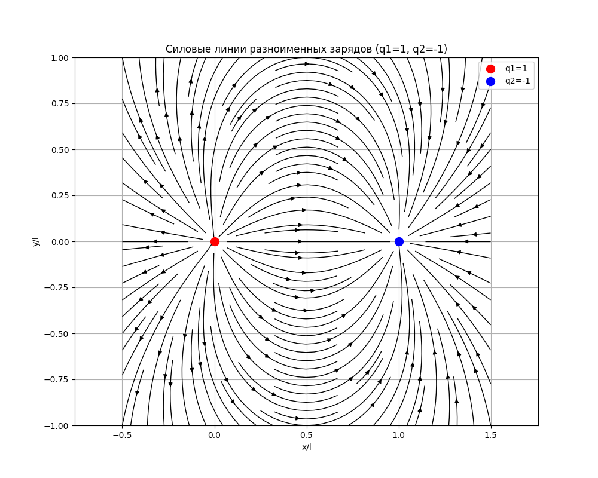
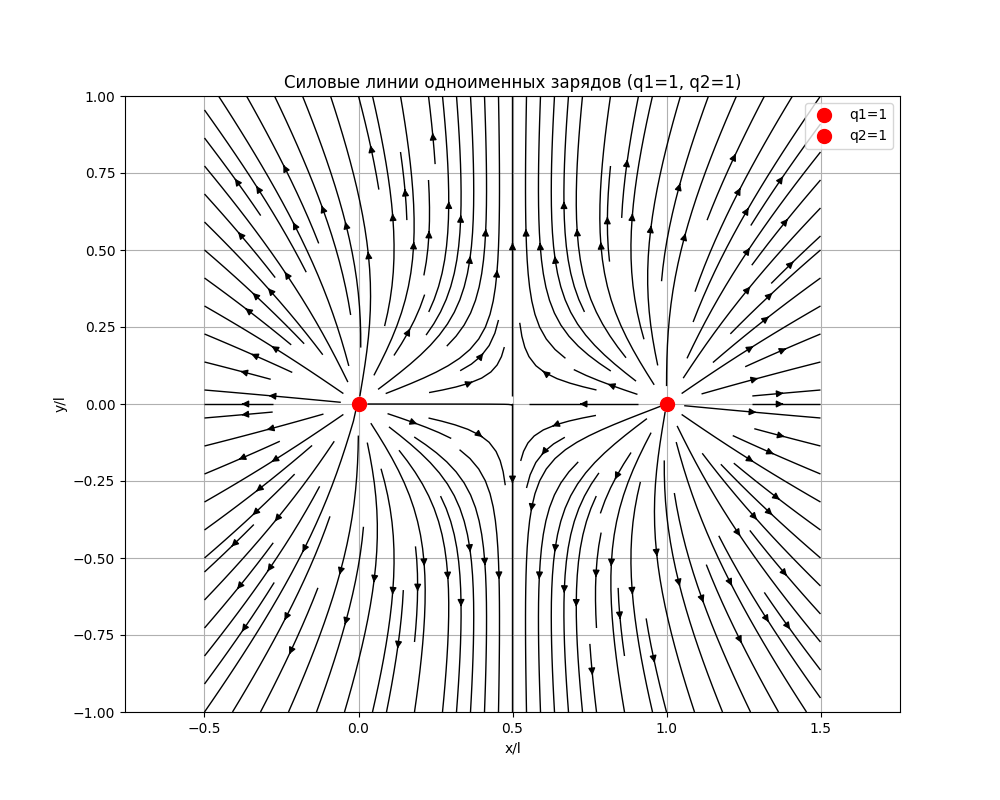

# Phisics_6.01
## Лабораторная работа №6. Моделирование электрического поля

### Описание
В этой лабе нужно было построить силовые линии для двух зарядов. Есть два случая: когда заряды одинаковые и когда разные. Всё сделано на питоне.

### Как запускать
Нужен Python 3 и библиотеки `numpy` и `matplotlib`. 
Запускаем файл `solution.py`:

```
python solution.py
```

### Теория
В задании дано уравнение для силовых линий:

$$ \frac{dy}{dx} = \frac{E_y}{E_x} $$

Я привел его к безразмерному виду, чтобы не мучиться с единицами измерения. В коде всё считается через это уравнение.

### Результаты

#### 1. Одноименные заряды
Тут два плюса (ну или минуса), они отталкиваются.



#### 2. Разноименные заряды
Тут плюс и минус, они притягиваются, получается диполь.



### Вывод
Программа работает, графики совпадают с тем, что в методичке. Для одноименных зарядов линии расходятся, для разноименных — идут от одного к другому.
